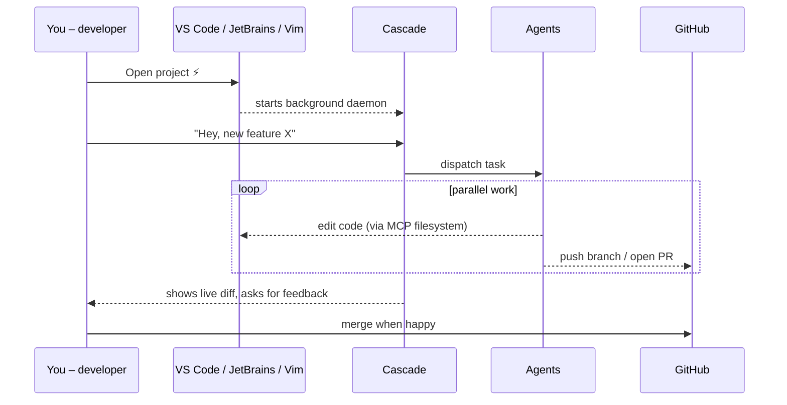
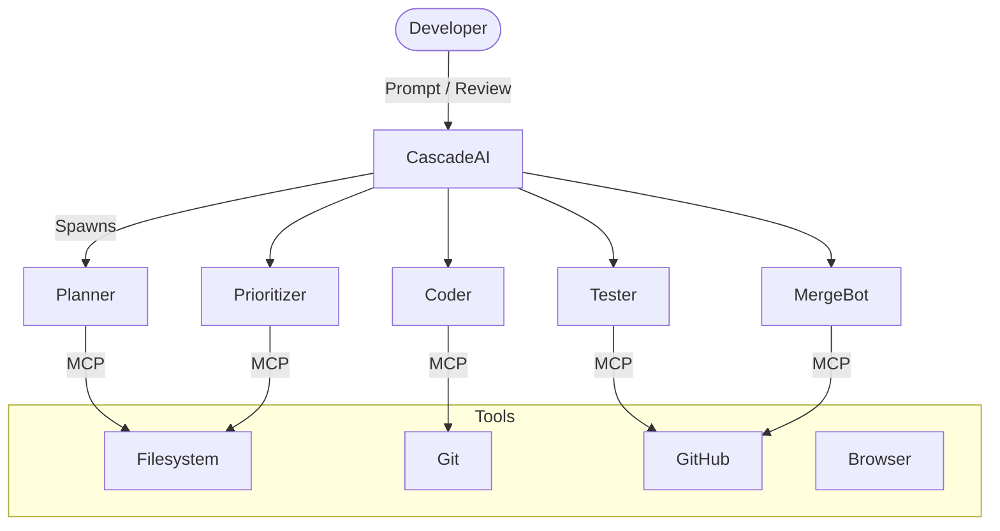

# 🧭 How the *Multi-Agent Bootstrap Kit* Works

> Rendered on GitHub → the Mermaid diagrams below will auto-render once pushed.  You can also paste them into <https://mermaid.live/> for an instant preview.

---

## 0. Mental model in 30 seconds

```
┌─────────┐      prompt      ┌────────────┐    code / PRs    ┌───────────┐
│  You 👩‍💻 │ ───────────────▶ │  Cascade AI │ ───────────────▶ │  GitHub   │
└─────────┘                 └────────────┘                   └───────────┘
         ▲                        │     ▲
         │                        │     │
       local IDE            orchestrates│
         │                        │     │
         └──────── uses MCP tools ──────┘
```

* **You** stay in your favourite editor / terminal.
* **Cascade** is the conductor that delegates work to specialised *agents* (Planner, Prioritizer, Coder, Tester, Merge-bot …​).
* **MCP tools** (filesystem, git, GitHub, browsers, etc.) give every agent hands and eyes.
* **GitHub** remains the single-source-of-truth and CI spine.

---

## 1. Opening a new IDE window – what happens?

### Sequence (Mermaid)


### Flowchart (roles)


---

## 2. How far can it scale?

| Dimension              | Today                                 | Practical upper bound |
| ---------------------- | ------------------------------------- | --------------------- |
| Concurrent agents per repo | 5 default (Planner → Merge-bot)       | ▶ 20 – 30 (CPU-bound) |
| Repos handled at once  | 1 IDE window = 1 workspace            | depends on RAM / CPU  |
| File operations per min| ~100 write/read ops (throttled)        | tunable via rate-limiter |
| Branch / PR throughput | 2-3 per minute (GitHub API quota safe) | GitHub API quota      |

Guideline: a modern MacBook (M-series / 16 GB) comfortably runs **10 agents** in parallel while you code & compile.

---

## 3. Roadmap – making each agent *self-sufficient*

1. **Local *mem0* cache** – every agent gets a tiny LMDB / SQLite key-value store for fast recall between prompts.
2. **Full MCP toolbelt** – expose `filesystem`, `github`, `git`, `browser_preview`, etc. directly to agents so they can:
   * inspect the repo like Windsurf’s *codebase ingestion* does;
   * run & read unit tests;
   * open PRs and request reviews.
3. **Checker agents** – lightweight verifiers attached to each IDE window; they lint, test, and sanity-check branches before PR.
4. **Human-in-the-loop hooks** – ↳ *you* decide when to:
   * freeze an agent’s memory;
   * promote a suggestion to code;
   * merge PRs.

> **Efficiency note** – Even with extra autonomy, keeping one *conversation thread* with Cascade saves token cost and cognitive load. The agents spin up/down as subtasks rather than permanent chatbots.

---

## 4. Tips for *vibe coding* 🪩

| If you … | Then try … |
| -------- | ---------- |
| Get writer’s block | Ask Cascade: *“Draft the skeleton file for XYZ”* |
| Need domain research | Spawn a *Researcher* agent (uses `search_web`) |
| Doubt an output | Tell Cascade: *“Run the Tester agent on branch feat/foo”* |
| Want to explore ideas freely | Work on a *scratch* branch; agents respect branch isolation |
| Prefer visuals | Add ` ```mermaid` blocks in chats – Cascade will embed them |

Enjoy the flow – you stay DJ, the bots keep the beat 🎛️.
